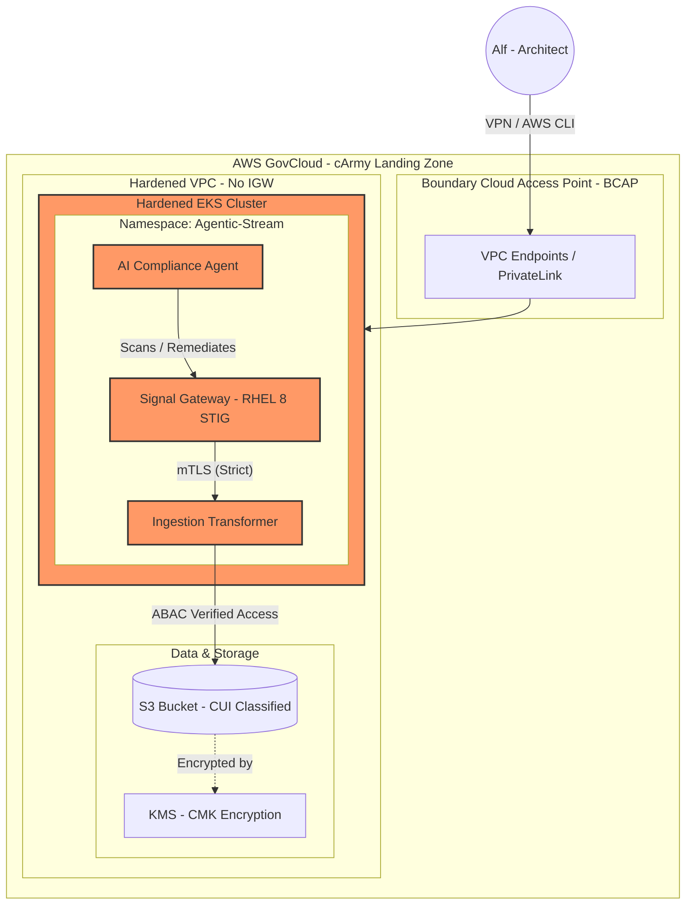

# Mia cArmy Agentic Stream ⚡

Root CA: Offline, highly protected (simulated). 
Intermediate CA: Used to sign service certificates. 
Service Certificates: Each pod in EKS gets a unique identity.

### Hardened AWS GovCloud Architecture for High-Compliance Environments

This repository demonstrates a **Senior Solution Architect** approach to building secure, cost-optimized, and automated infrastructure within the **Army Enterprise Cloud Management Agency (ECMA)** framework.

## 🛡️ Core Pillars of the Architecture

### 1. Infrastructure Hardening (NIST 800-53 & STIGs)
* **Zero-Trust Networking:** Enforced **mTLS (Mutual TLS)** for all service-to-service communication using Go and Istio patterns, satisfying **SC-8**.
* **Compute Security:** EKS worker nodes utilize **DISA STIG-hardened RHEL 8 images** with **IMDSv2** enforced to prevent SSRF attacks (**CM-6**).
* **Boundary Protection:** Designed for **BCAP** (Boundary Cloud Access Point) compliance, utilizing **VPC Endpoints** and **PrivateLink** to eliminate the need for an Internet Gateway (IGW).

### 2. Agentic Compliance (The "Nervous System")
* **Automated Remediation:** Integrates an **Agentic RAG** pattern that parses **Wiz/Tenable** vulnerability scans and maps them to **NIST 800-53** controls for automated Terraform-based healing.
* **Policy-as-Code:** Uses Terraform to enforce AES-256 **KMS Envelope Encryption** for all S3 and RDS data at rest (**SC-28**).

### 3. Financial Governance (Cost Modeling)
* **Lifecycle Management:** Automated S3 policies to transition **CUI (Controlled Unclassified Information)** to **Glacier Instant Retrieval**, reducing storage costs by ~60% while meeting 1-year retention mandates.
* **Compute Efficiency:** Leveraging **Karpenter** for EKS and **Spot Instances** for stateless signal processing to maximize budget utilization.

## 🚀 Quick Reference
* **Compliance Baseline:** NIST 800-53 Rev 5 (Moderate/High)
* **Cloud Ecosystem:** AWS GovCloud / cArmy / ECMA
* **Primary Stack:** Go, Terraform, Docker, Kubernetes (EKS), Kafka

---

# MIA cArmy Tagging & ABAC Standard

This document defines the mandatory tagging schema for the **Agentic Data Nervous System**. These tags are used by the IAM ABAC policies to enforce **NIST 800-53 AC-3** (Access Enforcement) across AWS GovCloud resources.

## 1. Core Tagging Matrix

| Entity | Key | Value (Example) | Purpose |
| :--- | :--- | :--- | :--- |
| **S3 Bucket** | `Project` | `AgenticStream` | Ensures data isolation between mission workloads. |
| **S3 Bucket** | `Classification` | `CUI` | Identifies Controlled Unclassified Information per ECMA standards. |
| **EKS Pod** | `Project` | `AgenticStream` | Identity matching for service-to-service data access. |
| **IAM User** | `Classification` | `CUI` | Determines the "Clearance" level for manual data retrieval. |

## 2. Enforcement Logic
All resources must be tagged at creation. The Terraform `aws_iam_policy.carmy_abac_s3_access` uses these attributes to dynamically permit or deny `s3:PutObject` and `s3:GetObject` operations without requiring individual IAM Role updates.

## 3. Compliance Mapping
* **NIST 800-53 AC-3:** Access Enforcement via Attribute-Based Access Control.
* **NIST 800-53 SC-28:** Protection of Information at Rest (combined with KMS encryption).

---

# Author: Alf Baez
### Hardened AWS GovCloud Architecture for High-Compliance Environments

This repository demonstrates a **Senior Solution Architect** approach to building secure, cost-optimized, and automated infrastructure within the **Army Enterprise Cloud Management Agency (ECMA)** framework.

