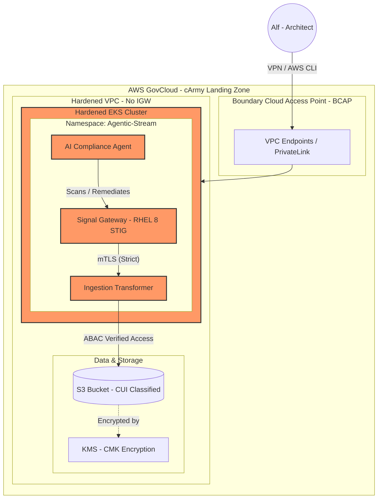

# Mia cArmy Agentic Stream ⚡

Root CA: Offline, highly protected (simulated).

Intermediate CA: Used to sign service certificates.

Service Certificates: Each pod in EKS gets a unique identity.

# MIA cArmy Tagging & ABAC Standard

This document defines the mandatory tagging schema for the **Agentic Data Nervous System**. These tags are used by the IAM ABAC policies to enforce **NIST 800-53 AC-3** (Access Enforcement) across AWS GovCloud resources.

## 1. Core Tagging Matrix

| Entity | Key | Value (Example) | Purpose |
| :--- | :--- | :--- | :--- |
| **S3 Bucket** | `Project` | `AgenticStream` | Ensures data isolation between mission workloads. |
| **S3 Bucket** | `Classification` | `CUI` | Identifies Controlled Unclassified Information per ECMA standards. |
| **EKS Pod** | `Project` | `AgenticStream` | Identity matching for service-to-service data access. |
| **IAM User** | `Classification` | `CUI` | Determines the "Clearance" level for manual data retrieval. |

## 2. Enforcement Logic
All resources must be tagged at creation. The Terraform `aws_iam_policy.carmy_abac_s3_access` uses these attributes to dynamically permit or deny `s3:PutObject` and `s3:GetObject` operations without requiring individual IAM Role updates.

## 3. Compliance Mapping
* **NIST 800-53 AC-3:** Access Enforcement via Attribute-Based Access Control.
* **NIST 800-53 SC-28:** Protection of Information at Rest (combined with KMS encryption).

---

